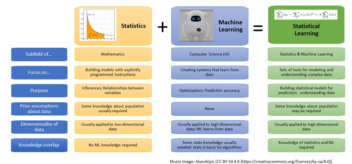
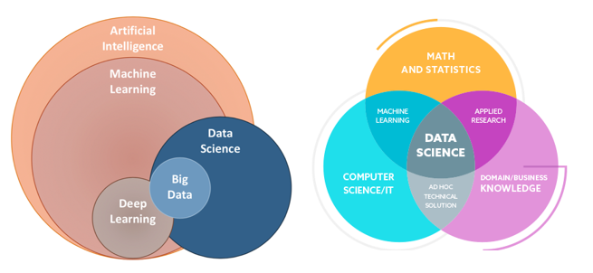
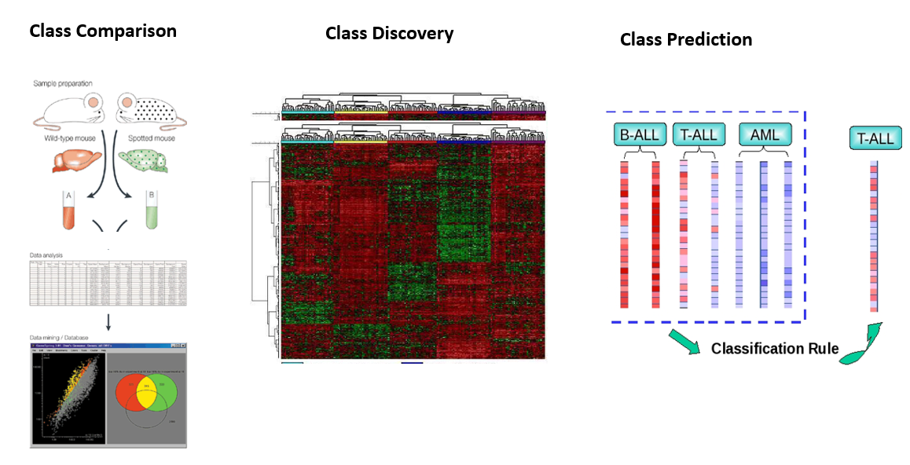

<style type="text/css">
.remark-slide-content {
    font-size: 22px;
    padding: 1em 4em 1em 4em;
}
.left-code {
  color: #777;
  width: 38%;
  height: 92%;
  float: left;
}
.right-plot {
  width: 60%;
  float: right;
  padding-left: 1%;
}
</style>

```{r setup, include=FALSE}
options(htmltools.dir.version = FALSE, echo=FALSE,
        message=FALSE,warning=FALSE,
        fig.dim=c(4.8, 4.5), fig.retina=2, out.width="100%")

knitr::opts_chunk$set(echo = FALSE)

knitr::knit_hooks$set(mysize = function(before, options, envir) {
  if (before) 
    return(options$size)
})
```


# Outline

.columnwide[
  ### 1) [Introduction](#Introduction)
  ### 5) [Unsupervised learning](#Unsupervised)
  ### 6) [Supervised learning](#Supervised)
  ### 7) [Summary and Conclusions](#Summary)
  ### 8) [References and Resources](#Resources)
]

---

class: inverse, middle, center

name: Introduction

# Introduction and motivation

---

# Omics data are high dimensional

- So far, our analyses are dealing with a single variable (i.e. univariate analysis)

  - T-tests: one variable, two groups
  - ANOVA: one variable, > 2 groups
  
- Even when we analyze many variables, we proceed *one at a time*
  - Determine how to analyze one single variable separatedly
  - Apply the procedure to all variables, 
  - Perform multiple test adjustment
  
- This is not wrong, but, at least it can be criticized because interactions (correlations) are missed.

- Even if we attempt to account for interactions, visualization are limited to three dimensions.

- So the question arises of __*How can we analyze & visualize high-dimensional data in a global ("holistic") way, that is considering all data together?*__

---

# The analysis of high dimensional data

- The classical approach to analyzing high dimensional data is Multivariate Statistics which orginates in the early 20th century.
  - Pearson 1901, Hottelling 1933: Principal Components Analysis
  - TW Anderson (1958): First Multivariate Statistics (as we know today) book
  
- Although classical MV Statistics considered Exploratory Analysis it was strongly rooted in Statistical Modelling and Distribution theory.

- By the end of the 20th century, as computing power became available and data did not stop growing many aspects of multivariate statistics were re-casted from the side of computer science
  - Their approach was not so much in modelling multivariate distributions but on the algorithms.
  
- The underlying idea of this *Machine Learning* approach is that instead of focussing on a model, we focus on howw to build an algorithm to solve a certain problem given a set of of examples.

- This lead to the idea of *Learning from Data*

---

# Machine learning and Statistics

```{r out.width="100%", fig.align='center', fig.cap=''}

```

---

# More actors in the field

```{r out.width="100%", fig.align='center', fig.cap=''}

```

---

# In any case, what do we need it for?


```{r out.width="100%", fig.align='center', fig.cap=''}

```

---

class: inverse, middle, center

name: Resources
  
# References and Resources

---

