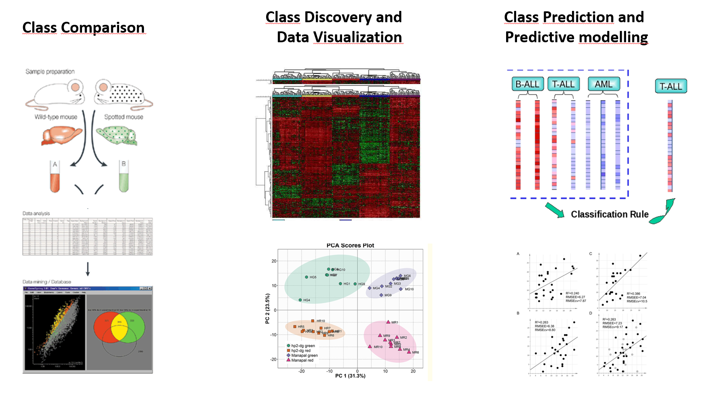
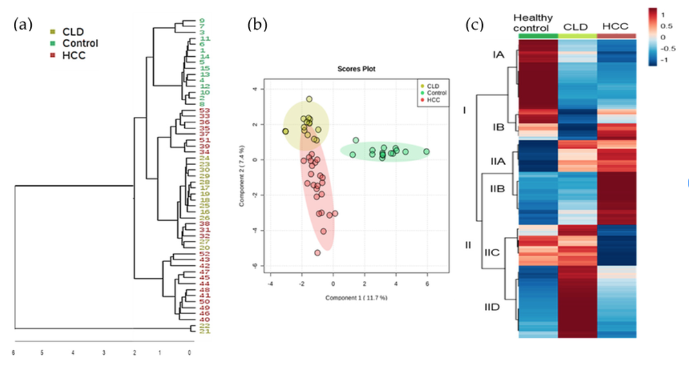
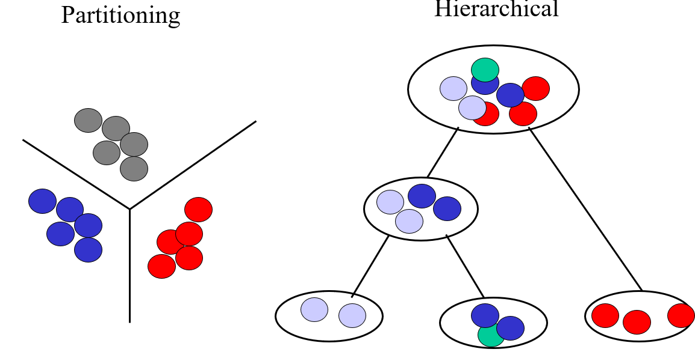
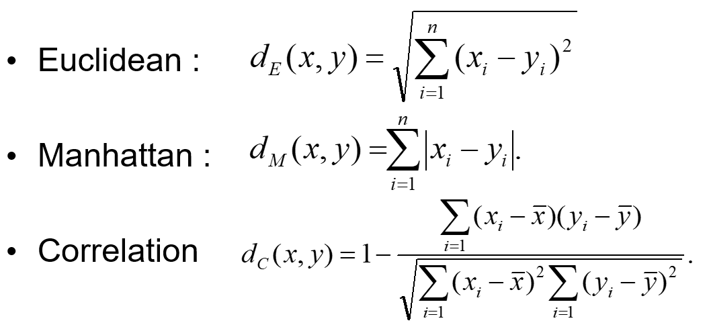
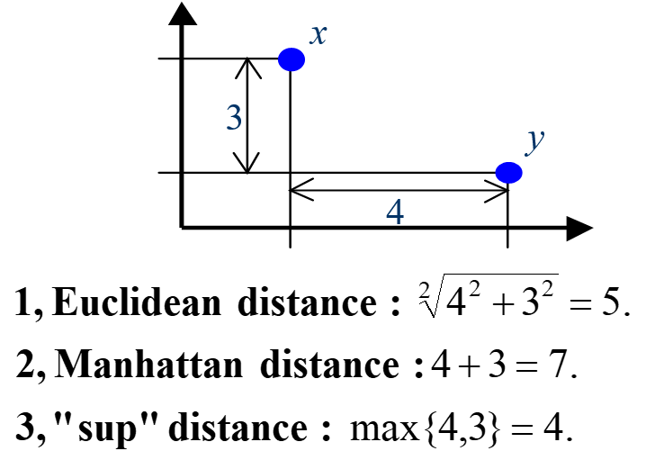
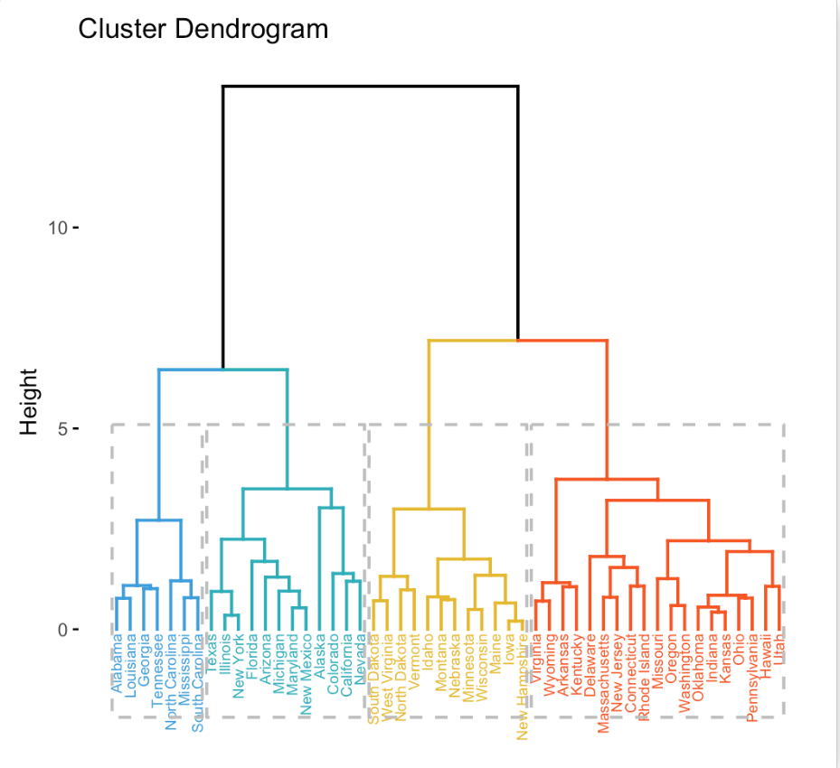
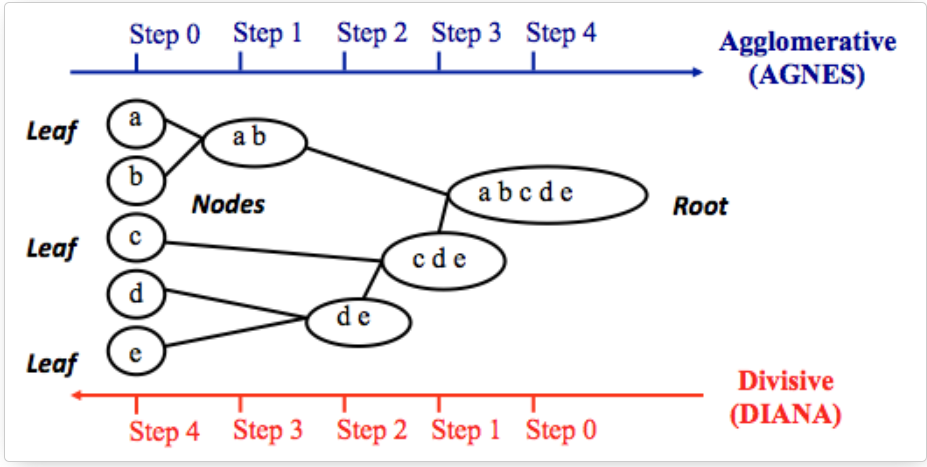
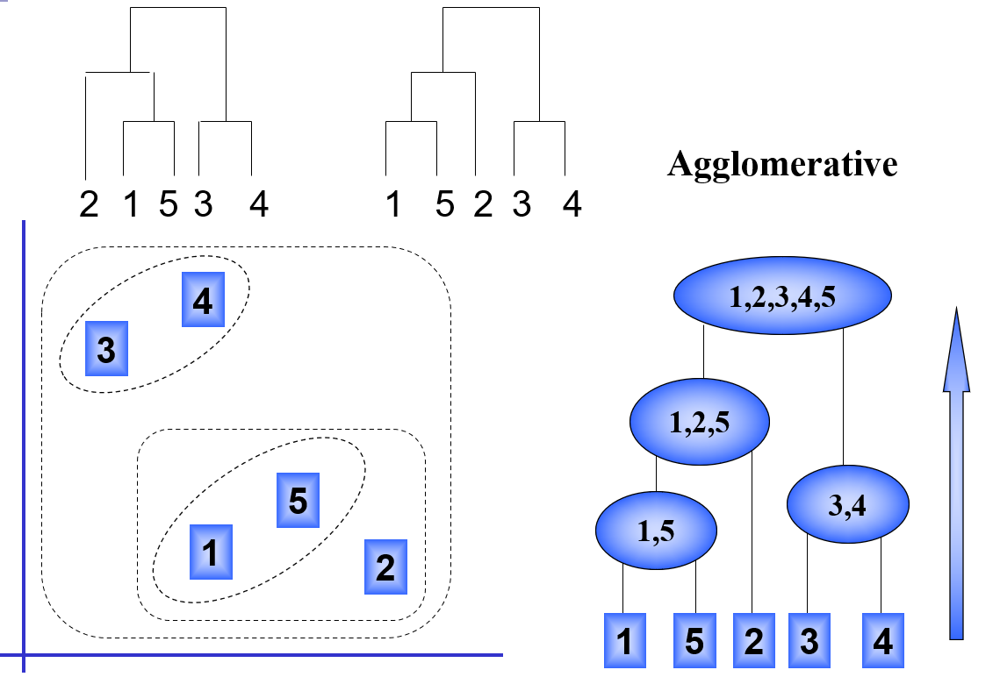
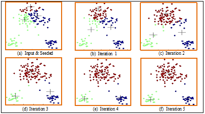

<style type="text/css">
.remark-slide-content {
    font-size: 22px;
    padding: 1em 4em 1em 4em;
}
.left-code {
  color: #777;
  width: 38%;
  height: 92%;
  float: left;
}
.right-plot {
  width: 60%;
  float: right;
  padding-left: 1%;
}
</style>

```{r setup, include=FALSE}
options(htmltools.dir.version = FALSE, echo=FALSE,
        message=FALSE,warning=FALSE,
        fig.dim=c(4.8, 4.5), fig.retina=2, out.width="100%")

knitr::opts_chunk$set(echo = FALSE)

knitr::knit_hooks$set(mysize = function(before, options, envir) {
  if (before) 
    return(options$size)
})
```


# Outline

.columnwide[
  ### 1) [Introduction](#Introduction)
  ### 5) [Unsupervised learning](#Unsupervised)
  ### 6) [Supervised learning](#Supervised)
  ### 7) [Summary and Conclusions](#Summary)
  ### 8) [References and Resources](#Resources)
]

---

class: inverse, middle, center

name: Introduction

# Introduction and motivation

---

# Omics data are high dimensional

- So far, our analyses are dealing with a single variable (i.e. univariate analysis)

  - T-tests: one variable, two groups
  - ANOVA: one variable, > 2 groups
  
- Even when we analyze many variables, we proceed *one at a time*
  - Determine how to analyze one single variable separatedly
  - Apply the procedure to all variables, 
  - Perform multiple test adjustment
  
- This is not wrong, but, at least it can be criticized because interactions (correlations) are missed.

- Even if we attempt to account for interactions, visualization are limited to three dimensions.

- So the question arises of __*How can we analyze & visualize high-dimensional data in a global ("holistic") way, that is considering all data together?*__

---

# The analysis of high dimensional data

- The classical approach to analyzing high dimensional data is Multivariate Statistics which orginates in the early 20th century.
  - Pearson 1901, Hottelling 1933: Principal Components Analysis
  - TW Anderson (1958): First Multivariate Statistics (as we know today) book
  
- Although classical MV Statistics considered Exploratory Analysis it was strongly rooted in Statistical Modelling and Distribution theory.

- By the end of the 20th century, as computing power became available and data did not stop growing many aspects of multivariate statistics were re-casted from the side of computer science
  - Their approach was not so much in modelling multivariate distributions but on the algorithms.
  
- The underlying idea of this *Machine Learning* approach is that instead of focussing on a model, we focus on howw to build an algorithm to solve a certain problem given a set of of examples.

- This lead to the idea of *Learning from Data*

---

# Machine learning and Statistics

```{r out.width="100%", fig.align='center', fig.cap=''}
knitr::include_graphics("2-MultivariateStat-and-ML_insertimage_1.png")
```

---

# More actors in the field

```{r out.width="100%", fig.align='center', fig.cap=''}
knitr::include_graphics("2-MultivariateStat-and-ML_insertimage_2.png")
```

---

# In any case, what do we need it for?


```{r out.width="100%", fig.align='center', fig.cap=''}

```

---

# Types of (multivariate) problems

## Class discovery (Unsupervised learning)
  - Goal: explore the data to find some intrinsic structures in them
    - Disregard whether they are related to the class labels or not) 
    - These patterns can be used to understand the key information within the data itself 
  - Methods: Clustering / Principal Components

  
## Class prediction / Predictive modelling
  - Goal: discover patterns in the data that relate data attributes with related to a target (categorical or numerical) attribute. 
   - These patterns can be utilized to predict the values of the target attribute in future data instances.
  - Methods: Regresion(s), Classification

---

class: inverse, middle, center

name: Unsupervised
  
# Unsupervised methods (1) : Clustering

---


# Discovering Groups in Data

.pull-left[

-   Clustering techniques allow for the identification of patterns and structures in data.

-   They work by partition the data space in regions where the data are more similar within each region than among regions.

- Many methods and approaches. Here we only consider:

  - Hierarchichal clustering 
  - K-Means, a partiive algorith
]

.pull-right[

```{r out.width="100%", fig.align='center', fig.cap=''}


```

]

---
# The components of clustering

- There are many clustering methods and algorithms but they all have a common goal: *Try to put togeher objects that are logically similar in characteristics*

- Cluster analysis is based on two main ingredients:

  - A *Distance measure*: to quantify the (dis)similarity of objects.
      - Notice we need to be able to measure the distance between individuals, but also between clusters.
  
  - *Cluster algorithm*: A procedure to group objects. Aim: small within-cluster distances, large between-cluster distances.

---
# What distance to use?

.pull-left[

```{r out.width="100%", fig.align='center', fig.cap=''}

```


```{r out.width="60%", fig.align='center', fig.cap=''}

```
]

.pull-right[

- Base the choice of distance in:
  - the application area
  -  your understanding of what sort of similarities you wish to detect?

- Correlation distance dc measures trends or relative differences.
- Euclidean and Manhattan distance both measure absolute differences between vectors.
- Manhattan distance is more robust against outliers.
- After standardization, Euclidean and correlation distance are equivalent

]
---

# Hierarchichal clustering

.pull-left[

- Hierarchical Clustring Analysis (HCA) seeks to build a hierarchy of clusters by iteratively grouping/splitting groups by their similarity.

- The result of HCA is a tree-based representation of the objects, which is also known as *dendrogram.* 

- Observations can be subdivided into groups by *cutting the dendrogram at a desired similarity level*.

- HCA avoid specifying the number of clusters by providing a partition for each k obtained from cutting the tree at some level.
]


.pull-right[


]

---

# Strategies for Hierarchical clustering

.pull-left[
They generally fall into two categories: 

- *Agglomerative*

  - This is a "bottom-up" approach: 
  - Each observation starts in its own cluster, and 
  - Pairs of clusters are merged as one moves up the hierarchy.

- *Divisive*: 
   - This is a "top-down" approach: 
    - All observations start in one cluster, and 
    - Splits are performed recursively as one moves down the hierarchy.

]

.pull-right[

```{r out.width="90%", fig.align='center', fig.cap=''}

```
```{r out.width="90%", fig.align='center', fig.cap=''}

```


Source: [Hierarchichal clustering in R](https://www.datanovia.com/en/courses/hierarchical-clustering-in-r-the-essentials/)

]

---

# Partitioning Methods

- These algorithms partition the data into a **pre-specified** number, $k$, of mutually exclusive and exhaustive groups.
- They work by iteratively reallocating the observations to clusters 
until some criterion is met, 
  - For example until "within cluster sums of squares" is minimized.

- Some Partitioning methods are:
  - k-means, 
  - Partitioning Around Medoids, PAM.
  - Self-organizing maps (SOM)
  - Fuzzy clustering which needs to have un underlying stochastic model, e.g. Gaussian mixtures.

---

# The K-means algorithm

.pull-left[

1. Randomly chooses $k$ observations from the dataset and uses these as the initial means.
2. For the next object calculate the similarity to each existing centroid.
3. If the similarity is greater than a threshold add the object to the existing cluster and re-compute the centroid, else use the object to start new cluster
4. Return to step 2 and repeat until done
]

.pull-right[

```{r out.width="90%", fig.align='center', fig.cap=''}

```

]

---

# Other clustering related issues

- Selecting the number of clusters

  - Often an important issue. Needs to devote some time
  - There exist criteria such as "maximize average silhouette"
  
- Determining the validity of clusters

  - All cluster algorithms will yield clusters
  - Need some way to determine if *they are real*
  - Typical approximation: Use resampling to build multiple clusterings and check consistency.
  
  
---

class: inverse, middle, center

name: PCA
  
# Principal Components Analysis


---

class: inverse, middle, center

name: Resources
  
# References and Resources

---
# Resources

- Multivariate Data Analysis Course. Carlos O. Sanchez
  [Course Slides](http://i2pc.es/coss/Docencia/ADAM/Notes/MultivariateAnalysisSlides.pdf)

- Principal Component Analysis Overview
  [PCA Overview](https://towardsdatascience.com/tidying-up-with-pca-an-introduction-to-principal-components-analysis-f876599af383)

- Hierarchical Clustering
  - [Hierarchical Clustering Overview](https://se.mathworks.com/discovery/hierarchical-clustering.html)

  - [Hierarchichal clustering in R](https://www.datanovia.com/en/courses/hierarchical-clustering-in-r-the-essentials/)

- Iris Data PCA
  [Iris Data PCA Code](https://gist.github.com/chriddyp/7c6c43682a8f57a1f999)


