```{r setup, include=FALSE}
options(htmltools.dir.version = FALSE)
```

```{r packages, include=FALSE}
# require(devtools)
# if(!require(installifnot)) install_github("uebvhir/installifnot")

# library("bibtex")
```

# Outline

.columnwide[
  ## 1) [Introduction and Motivation](#Introduction)
  ## 2) [Exploration of Multivariate Data](#Descriptive)
  ## 3) [Dimension Reduction](#Factorizations)
  ## 4) [Discovering Groups in Data](#Clustering)
  ## 5) [References and Resources](#References)
]  

---

class: inverse, middle, center

name: Introduction

# Introduction and Motivation

---

# The Right Approach for Omics?

.pull-left[

-   Classical Statistics

    -   Multiple regression

    -   Discriminant analysis

    -   ANOVA

-   Data tables are *long* and *not very wide ("more individuals than variables")*
]
.pull-right[

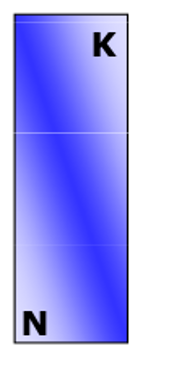
]

---

# The Nature of Omics Data

.pull-left[

-   Omics data have a different structure than usual in multivariate statistics.

-   They measure different characteristics

  -  GC/MS spectra, Expression, Concentration...

-   Though they have common aspects

-   Most of them are high throughput

]
.pull-right[

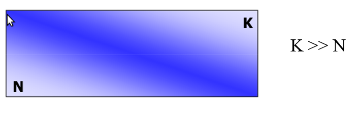


  -   Many variables (**K**) measured simultaneously

  -   Few samples (**N**) analyzed
]

---

# A (More) Suitable Approach

.pull-left[

- With omics data, it is common to apply methods known as *projection* or *dimension reduction* methods

- They offer interesting advantages
  - Examine ALL variables together
  - Avoid loss of information
  - Find underlying trends = "latent variables"
]

.pull-right[
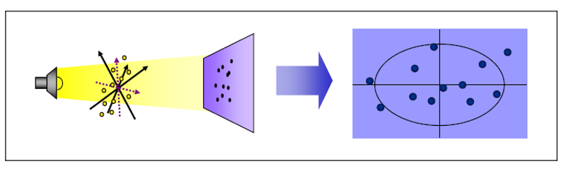
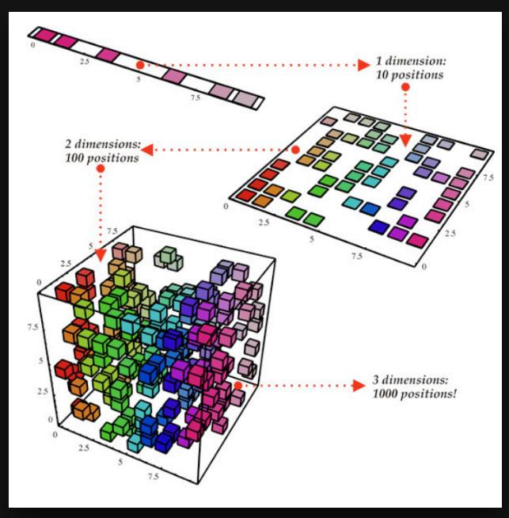
]

---

# What is a Projection?

.pull-left[

-   Variables = axes in a multidimensional space

-   Observations = points in the multidimensional space

-   Projecting points onto (hyper)planes *can make it possible*

    -   Simplify/Improve visualization

    -   Highlight inherent or natural groupings in the data

    -   Emphasize the relationship between these groups.

    -   Detect issues such as batch effects or outliers
]

.pull-right[
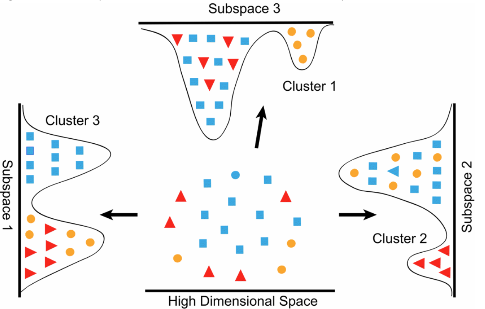
[Data Science post: What is dimensionality reduction](https://datascience.stackexchange.com/questions/130/what-is-dimensionality-reduction-what-is-the-difference-between-feature-selecti)
]

---

# Geometric and Algebraic Approach

.pull-left[

-   Projections can always be considered from an algebraic or geometric viewpoint

    - Algebraically: The information of the observations is summarized in some new (latent) variables

    - Geometrically: The set of points in a K-dimensional space (K = number of variables) is *approximated* by a (hyper)plane, a space of lower dimension where the points are projected.
]

.pull-right[
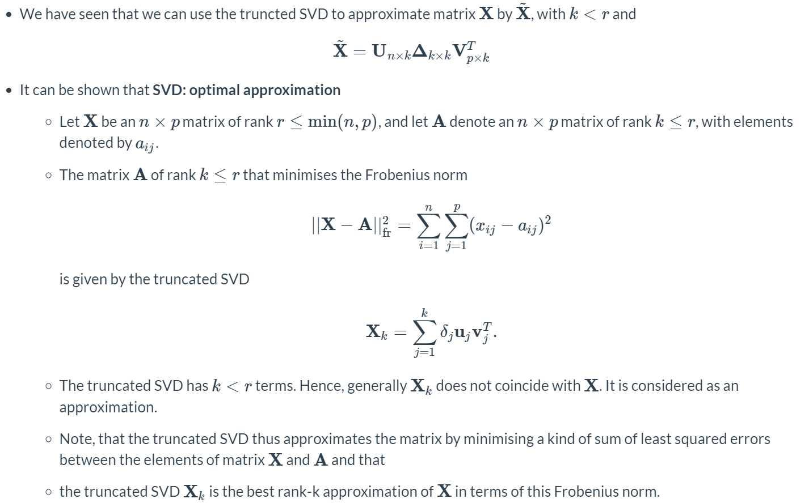

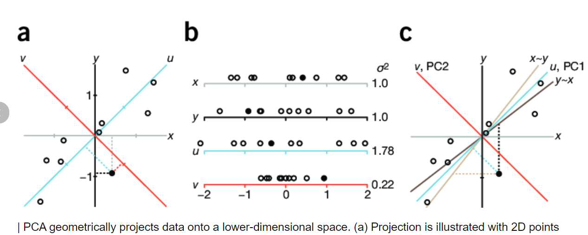
]

---

# Organization of Contents 

- Initial exploratory analysis

  -   Description and possible transformations

-   Projection/dimension reduction or matrix decomposition methods.
    -   We will focus on Principal Component Analysis (PCA), but mention other approaches

-   Pattern or class discovery methods

    -   Cluster analysis and agglomerative methods (KMeans/PAM)

---

class: inverse, middle, center

name: Descriptive

# Exploration of Multivariate Data

---

# I. Data Description

.pull-left[

-   We will start any statistical analysis by observing the data
  -   Which/How many variables,
  -   Which/How many samples
  -   Are there missing values?
  -   Obtain simple summary statistics and graphs

- We can calculate usual descriptive statistics, starting with univariate measures and progressing to bivariate or multivariate statistics
]

.pull-right[

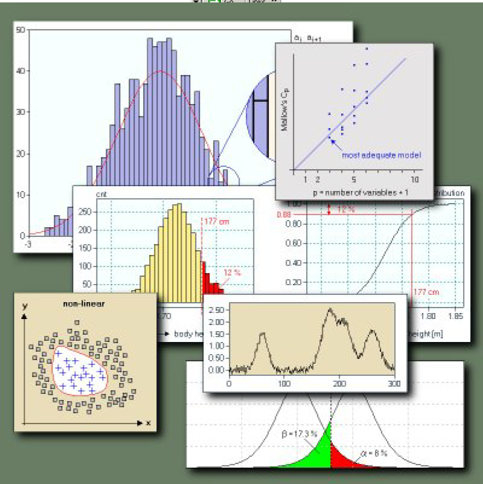

]

---

# Univariate Numerical Summaries

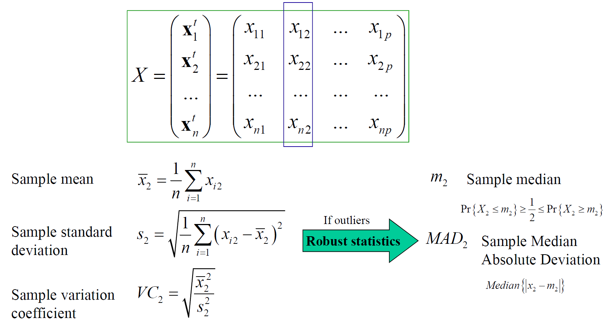
[Source: Multivariate Data Analysis Course. Carlos O. Sanchez](http://i2pc.es/coss/Docencia/ADAM/Notes/MultivariateAnalysisSlides.pdf)

---

# Bivariate Numerical Summaries

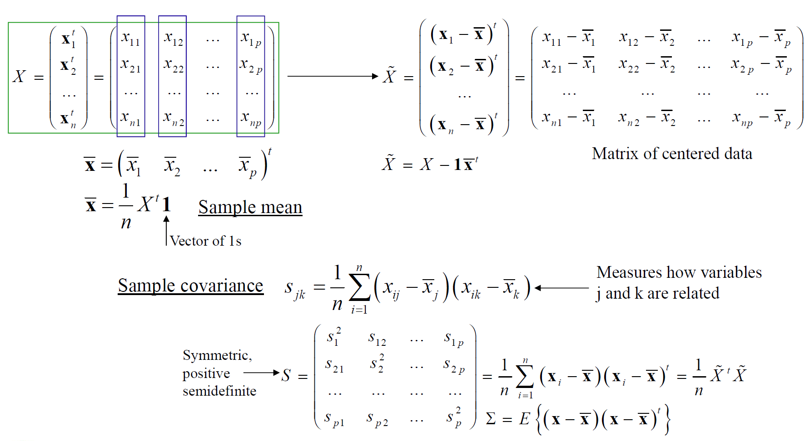
[Source: Multivariate Data Analysis Course. Carlos O. Sanchez](http://i2pc.es/coss/Docencia/ADAM/Notes/MultivariateAnalysisSlides.pdf)

---

#   Multivariate Distances (1)

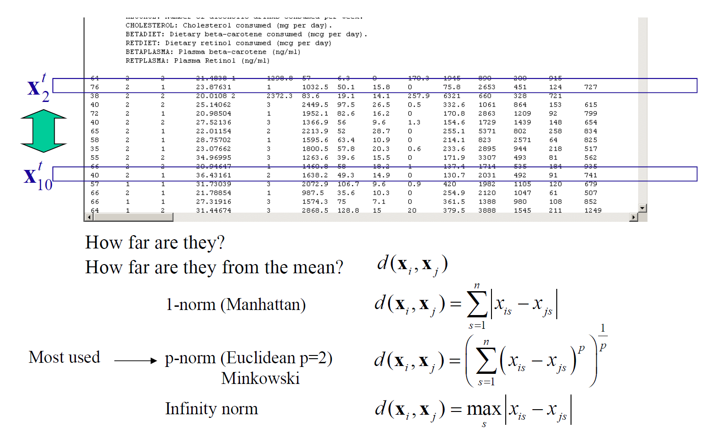
[Source: Multivariate Data Analysis Course. Carlos O. Sanchez](http://i2pc.es/coss/Docencia/ADAM/Notes/MultivariateAnalysisSlides.pdf)

---

#   Multivariate Distances (2)

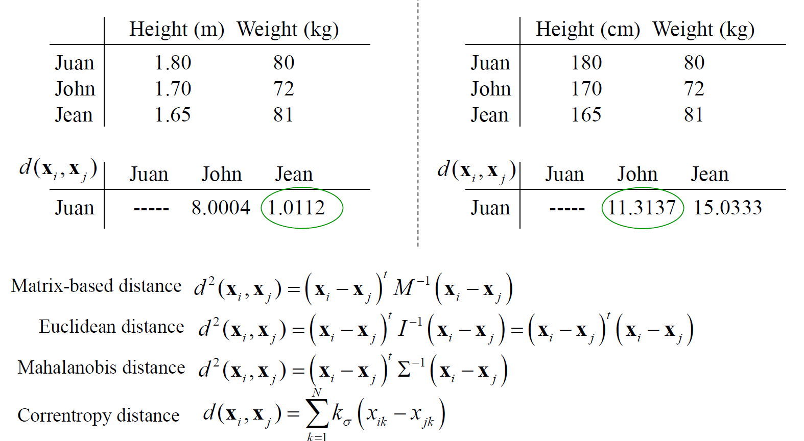
[Source: Multivariate Data Analysis Course. Carlos O. Sanchez](http://i2pc.es/coss/Docencia/ADAM/Notes/MultivariateAnalysisSlides.pdf)

---

#   Bivariate Dependence

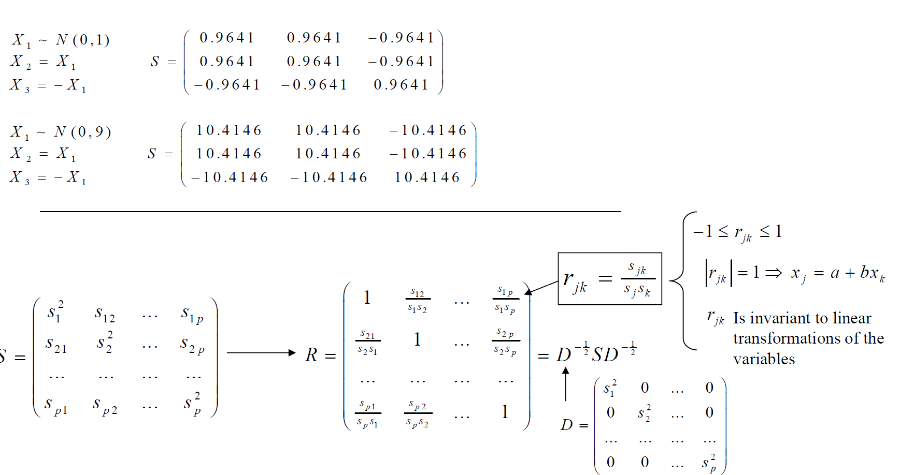
[Source: Multivariate Data Analysis Course. Carlos O. Sanchez](http://i2pc.es/coss/Docencia/ADAM/Notes/MultivariateAnalysisSlides.pdf)

---

#   Multivariate Dependence

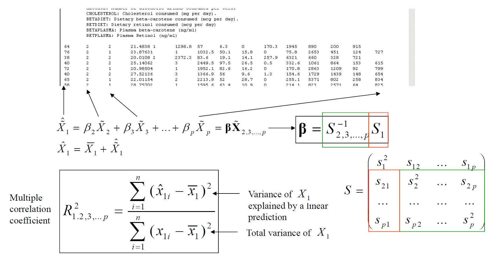
[Source: Multivariate Data Analysis Course. Carlos O. Sanchez](http://i2pc.es/coss/Docencia/ADAM/Notes/MultivariateAnalysisSlides.pdf)

---

#  Data Visualization

.pull-left[

-   It is possible to visualize the variables one by one

    -   Histogram, Boxplots, Violin plots, bar charts

-   But usually start with 2D or 3D graphs

    -   Multiple boxplot, Scatterplots, Mosaicplots

    -   Heatmaps are very popular
]

.pull-right[

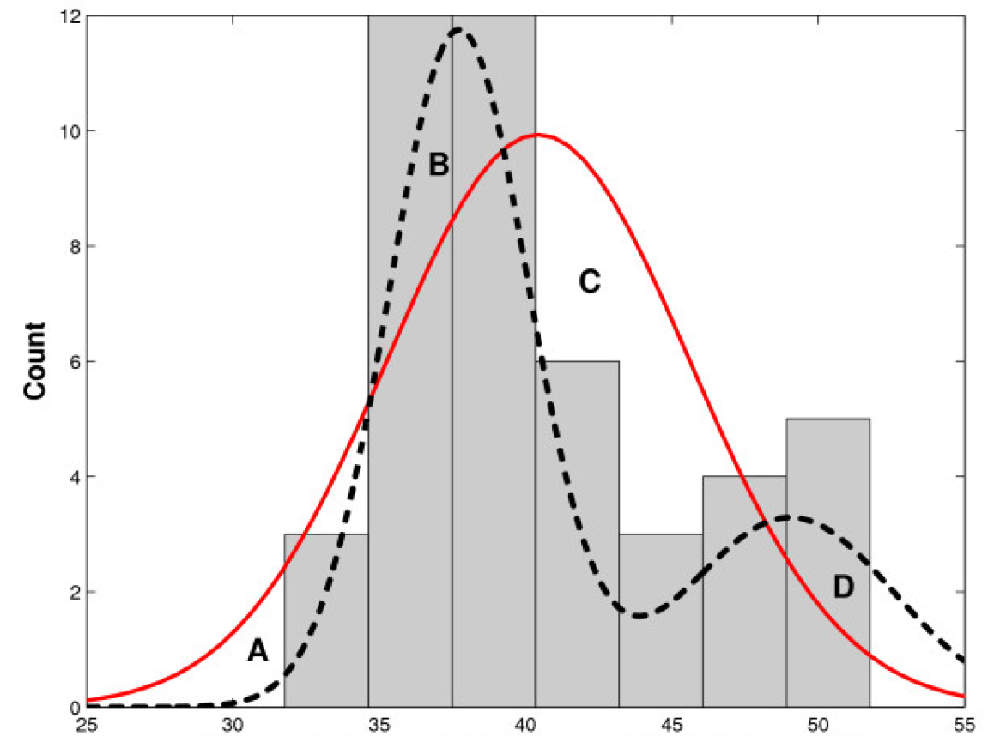
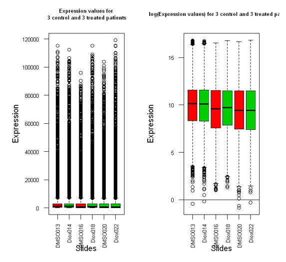
]

---

#  Visualizing Multiple Variables

- To work with three or more variables, there are different alternatives

  -   Obviously, one is to start with the above and represent the variables ignoring their relationship or studying them in pairs

  -   Another alternative is to work in reduced dimensions, i.e., represent, for example, 2 by 2 or 3 by 3 some of the first components.
  
- This is the approach discussed in the next section, dedicated to dimension reduction.

---

#  Data Exploration Example

.pull-left[

- This link [(Link to workflow)](https://bioconductor.org/packages/release/bioc/vignettes/POMA/inst/doc/POMA-demo.html) contains a complete workflow of metabolomics data using the POMA package from Bioconductor.
  -   The first steps show aspects such as data exploration, transformations, and detection and imputation of missing values.

  - Note the use of `SummarizedExperiment`, a generalization of the ExpressionSet class, originally designed for microarrays.
]

.pull-right[
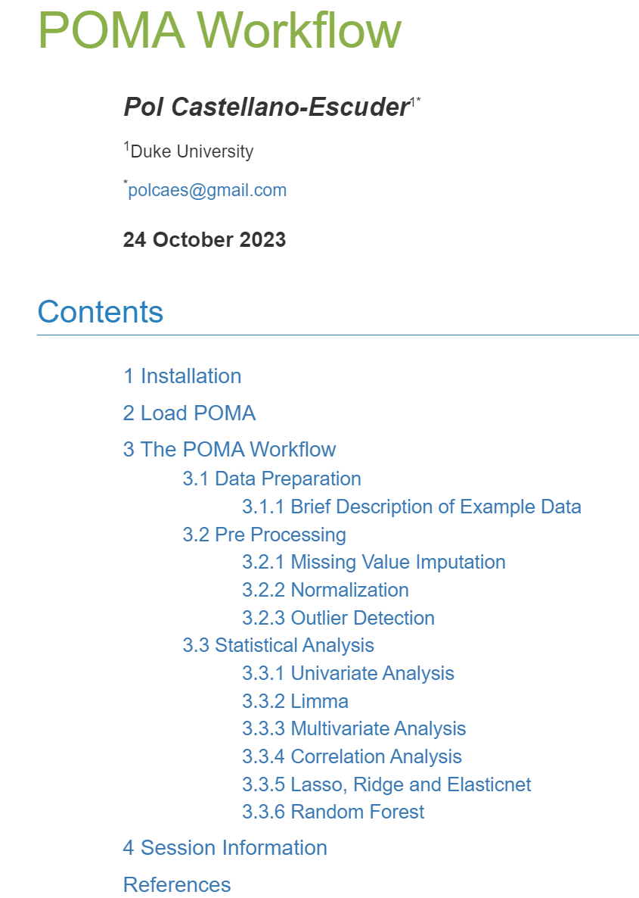
]

---

class: inverse, middle, center

name: Factorizations

# Dimension Reduction

---

# Principal Component Analysis

.pull-left[

-   Given a $KxN$ data matrix containing 
  - $K$ variables (probably correlated measurements) in 
  - $N$ samples (objects/individuals...)

-   Assuming $K < N$, PCA transforms the variables into $K$ new components that:

  -   Reflect the different sources of variability in the data, but

  -   Are not correlated, i.e., *each component represents a different source of variability,*
]

.pull-right[

```{r, fig.align='center', out.width='60%', fig.cap='', echo=FALSE}
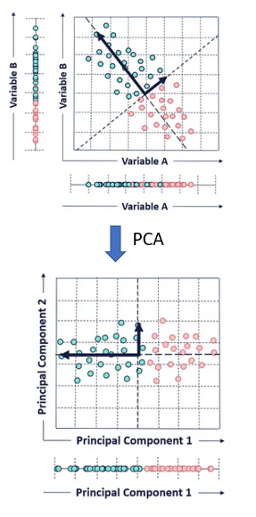
```
]
<!-- [Source](https://towardsdatascience.com/tidying-up-with-pca-an-introduction-to-principal-components-analysis-f876599af383) -->
<!-- ] -->

---

# Designed to Improve

.pull-left[

-   These new components are constructed in such a way that:

  - They are orthogonal (perpendicular) to each other
  - *They have decreasing explanatory power*: each component explains more (variance) than the next one.

-  I most cases, a few components (2 or 3) suffice to summarize most of the information contained in the original variables.

-  That is, one can use PCA values to obtain a decent representation in *reduced dimension*.
]

.pull-right[
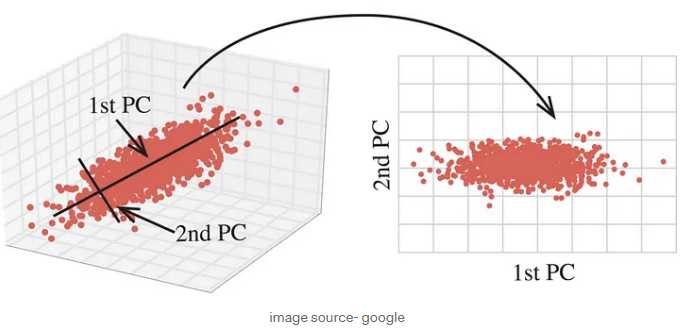
This picture depicts how, after performing PCA and retining the two first components, almost no information is lost.
]
---

# PCA highlights latent information


.pull-left[

-   It is generally assumed that PCA can be the basis to
  - Highlight dominant latent structures in the data,
  - As well as revealing natural groups, like genotypes or metabotypes,
  - And alos non natural unexpected groupings, due to batch effect.
  
- The image on the right shows the aspect of a PCA plot of a dataset before and after performing a batch adjustment.
]

.pull-right[

```{r, fig.align='center', out.width='70%', fig.cap='', echo=FALSE}
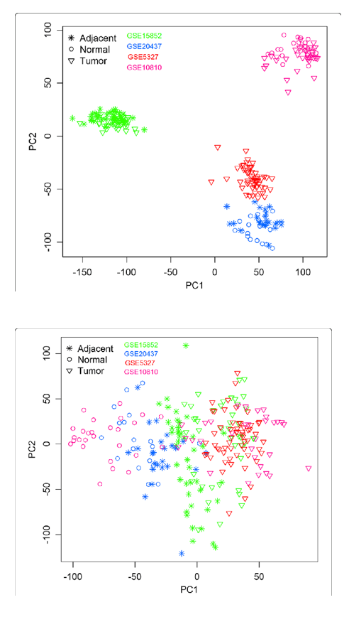
```
]

---


---

class: inverse, middle, center

name: Clustering

# Discovering Groups in Data

---

# Clustering

.pull-left[

-   Clustering techniques allow for the identification of patterns and structures in data.

  -   **K-means** and **PAM (Partitioning Around Medoids)** are two commonly used clustering techniques.

  -   These methods partition data points into a set number of clusters based on their similarity.

]

.pull-right[
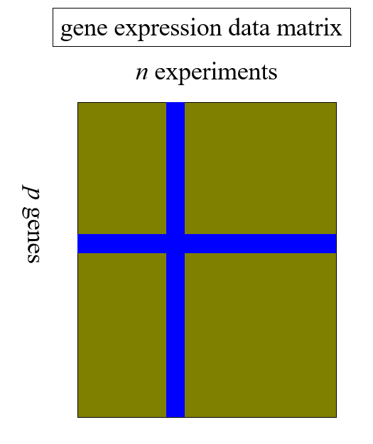
[Image: Clustering Visualization](https://rpubs.com/Fagbokforlaget/526362)
]

---

# Agglomerative Methods

.pull-left[

- **Hierarchical clustering** is an agglomerative method that builds nested clusters by merging or splitting them successively.

  - It creates a tree-like structure called a dendrogram, which can be cut at different levels to obtain varying cluster numbers.
  
]

.pull-right[
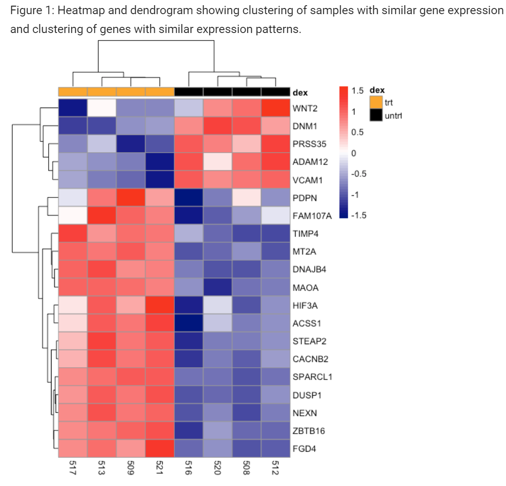
[Image: Hierarchical Clustering](https://se.mathworks.com/discovery/hierarchical-clustering.html)
]

---

# Heatmaps for Clustering

.pull-left[

- Heatmaps are a useful way to visualize clusters of variables and samples simultaneously.

  - Colors represent values of data points, with clustering applied to both rows and columns.

]

.pull-right[
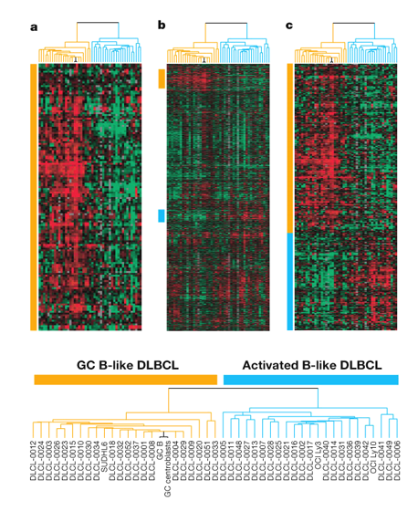
]

---

# Clustering in Action

- This link [(Link to workflow)](https://bioconductor.org/packages/release/bioc/vignettes/POMA/inst/doc/POMA-demo.html) contains a complete workflow of metabolomics data using the POMA package from Bioconductor.

- The final steps show aspects such as clustering and visualization using heatmaps.

---

class: inverse, middle, center

name: References

# References and Resources

---

# References and Resources

- Multivariate Data Analysis Course. Carlos O. Sanchez
  [Course Slides](http://i2pc.es/coss/Docencia/ADAM/Notes/MultivariateAnalysisSlides.pdf)

- POMA Package for Metabolomics
  [POMA Vignette](https://bioconductor.org/packages/release/bioc/vignettes/POMA/inst/doc/POMA-demo.html)
  
- Principal Component Analysis Overview
  [PCA Overview](https://towardsdatascience.com/tidying-up-with-pca-an-introduction-to-principal-components-analysis-f876599af383)

- Hierarchical Clustering
  [Hierarchical Clustering Overview](https://se.mathworks.com/discovery/hierarchical-clustering.html)

- Iris Data PCA
  [Iris Data PCA Code](https://gist.github.com/chriddyp/7c6c43682a8f57a1f999)

---
